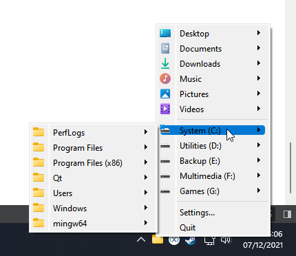
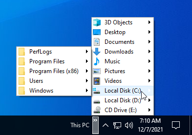

# TrayBrowser
A simple tool that sits in your system tray and offers a menu structure of all your mounted storage.

You can double-click any drive or directory to open it in the file explorer, or you can single-click any file to open it in the default app.

You can also right-click a drive, directory, or file to get a context menu for it. On Windows this is the default context menu for that entry, on Linux and Mac, it's a custom menu.
If someone knows how to get the default context menu for those platforms, please let me know.

Lastly, you can drag a folder or file outside the menu to move/copy/link it somewhere else.

## Motivation

For many many years (since Vista, or maybe even XP), I had a custom taskbar toolbar sitting in the right corner allowing me to browse the contents of my PC:

However, after upgrading to Windows 11 I realized Microsoft decided to remove taskbar toolbars for whatever reason, so you can't do this anymore. 
TrayBrowser tries to emulate that experience as closely as possible because my muscle memory is strong by now and I can't use my PC without that toolbar.

## Regarding the code
Qt does QMenu events a bit weirdly.
If you click an action that has a menu attached but the menu is not shown, the click event for that action will be sent to the menu that contains the action.
But if the action's menu is showing and you click the action, the menu of the action will receive the event. Even though it's the same action that was clicked in both instances.
This makes the code a bit muddier than it would normally have to be because we have to take care of both scenarios.

# Credits
Silk icon set (CC BY 2.5) by Mark James
Main icon (CC0 1.0) by Iconfinder